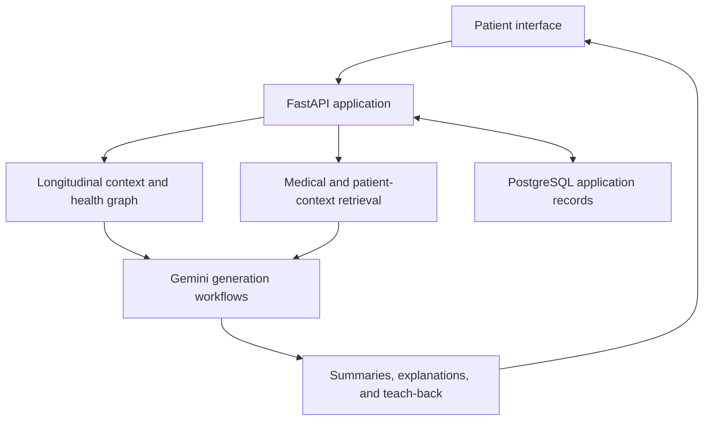

# CareContext

**Patient education that carries context across clinical encounters.**

CareContext is an early-stage healthcare AI startup developing a patient-facing application in collaboration with physicians at Eastern Virginia Medical School (EVMS). It brings together encounter summaries, a longitudinal patient context, medical reference retrieval, and teach-back questions to help patients understand information from their care team.

**Stage:** application implemented; development and testing ongoing; clinical validation pending.  
**Application:** [CareContext on Google Cloud](https://carecontext-291933096366.us-central1.run.app) — currently offline to control hosting costs.

[Architecture](docs/architecture.md) · [Engineering decisions](docs/engineering.md) · [Evaluation](docs/evaluation.md) · [Demo](demo/README.md)

## The problem

A patient's question rarely exists in isolation. Its meaning can depend on what a physician explained, what changed at the last visit, which medications are current, and what the patient understood. Information distributed across encounters needs to be assembled before an AI system can provide a useful explanation.

CareContext is designed around that continuity. The current implementation focuses on sickle cell disease workflows and maintains both clinical context and a representation of patient understanding.

## Product workflow

| Step | Application behavior |
| --- | --- |
| Capture an encounter | Extract structured information from encounter material |
| Build the explanation | Generate a summary and check medication statements against the source transcript |
| Carry context forward | Merge new information into a longitudinal dossier, distinguishing current, stopped, and considered medications |
| Check understanding | Generate teach-back questions and record comprehension feedback |
| Support follow-up questions | Combine encounter history, patient health graph context, and retrieved medical references |

## Designed and built by Sandeep Kalari

Clinical collaborators provided the patient-care problem, domain guidance, and clinical requirements. I translated those requirements into the technical design and built the application from scratch, including:

- the patient context pipeline, longitudinal dossier, and health graph;
- retrieval over medical knowledge and patient-specific context;
- LLM orchestration, structured extraction, summaries, and teach-back workflows;
- medication source checks and rule-based urgent-message handling;
- the browser interface, FastAPI backend, PostgreSQL persistence, and Google Cloud integration.

This work spans requirements translation, AI system design, application engineering, and deployment. The [engineering notes](docs/engineering.md) explain the decisions behind context updates, retrieval, and generation reliability.

## System architecture

The implementation uses **Python, FastAPI, Gemini through Vertex AI, Chroma, NetworkX, and PostgreSQL**. Cloud deployment configuration uses **Cloud Run, Cloud SQL, Secret Manager, and IAM**. See [architecture](docs/architecture.md) and [deployment](docs/deployment.md) for component responsibilities and current limits.

## Research and validation

The research questions concern preserving clinical meaning across visits, retrieving relevant evidence alongside individual context, and adapting explanations using comprehension feedback. The implementation includes targeted medication regression tests; clinical and operational evaluation results are not published yet.

The next development milestones are reviewed synthetic demonstration cases, a recorded walkthrough, and structured evaluation with clinical collaborators. See the [evaluation plan](docs/evaluation.md).

## Demo and source availability

The hosted application is currently paused. Screenshots, a walkthrough, and downloadable synthetic cases will be added as they become available. The [demo page](demo/README.md) describes the planned scenarios.

This public repository documents the product and engineering work. Application source, private prompts, internal configuration, and patient data are not distributed here.

CareContext is under development for patient education. It is not a clinically validated diagnostic, prescribing, or emergency decision system. See [safety design](docs/safety-design.md).
