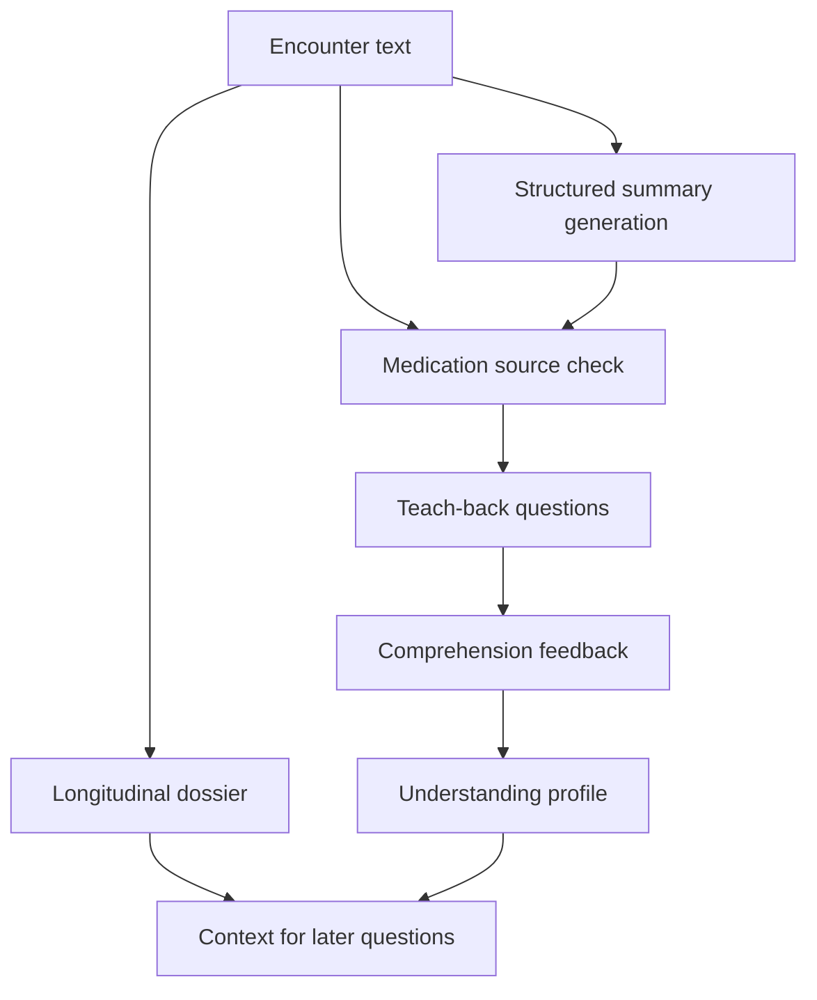
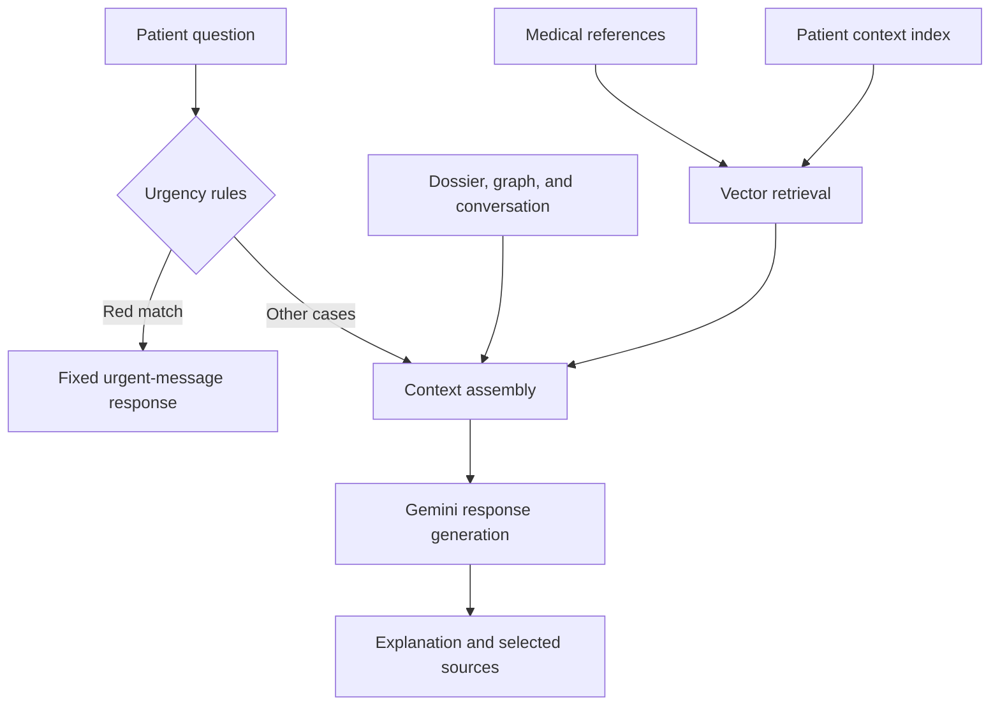

# Architecture

CareContext combines longitudinal patient context with medical reference retrieval. The browser interface communicates with a FastAPI backend; PostgreSQL stores application records, and Gemini supports extraction and generation.

## Encounter and comprehension workflow

The dossier merges information across visits. Medication state distinguishes taking a medication from stopping it or considering it. A rebuild path reconstructs the dossier from remaining encounters after a visit is deleted.

The patient health graph represents relationships among encounters, conditions, medications, labs, providers, and comprehension information. Graph context and the cumulative dossier support follow-up questions without treating each encounter as an isolated document.

## Retrieval and response generation

Retrieval searches two Chroma collections: medical knowledge and patient context. Patient-context queries use an identifier filter. Embedded descriptions of patient graph nodes make individual context searchable alongside medical references.

Medical reference connectors include MedlinePlus, openFDA drug labels, and PubMed article metadata. PubMed metadata retrieval does not constitute full-text evidence review. A TF-IDF fallback supports medical-document retrieval when the embedding path is unavailable; it does not provide equivalent patient-context coverage.

Chat context can also include the latest encounter, recent messages, and comprehension information. Source selection is heuristic, so claim-level grounding is a separate evaluation question.

## Generation and persistence

Structured tasks request JSON and use parsing and retry handling. Generation diagnostics include completion reason and latency. Medication checks apply to the encounter-summary workflow before teach-back generation; they do not validate every chat response.

PostgreSQL persists application records. The current Chroma client operates at application level; durable vector storage and synchronization across service instances remain deployment considerations.

Clinical validation is pending. Detailed prompts, clinical rules, source code, and deployment configuration remain private.

[Back to CareContext](../README.md)
