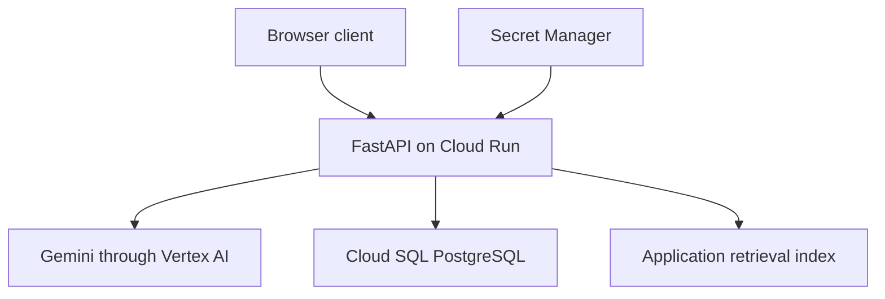

# Deployment

CareContext has been hosted on Google Cloud. The application is currently paused to control hosting costs. This page describes the implementation's deployment configuration, not a verified inventory of active cloud resources.

| Component | Responsibility |
| --- | --- |
| Cloud Run | Containerized FastAPI application |
| Vertex AI | Gemini model inference |
| Cloud SQL for PostgreSQL | Persistent application records |
| Secret Manager | Configured credential delivery |
| IAM service account | Cloud service permissions |
| Chroma | Application-level vector retrieval |

The model wrapper also includes a Gemini API-key path and an Ollama configuration. Their presence is not evidence of equivalent testing or deployment.

## Operational work before a public demo

A synthetic demo needs isolated records and credentials, verified application authentication and authorization, and explicit limits on requests and model expenditure. Cloud service access and application user access are separate concerns.

Index rebuilding, container restarts, and synchronization across instances require verification because the current Chroma client does not establish a shared durable vector service. Model failures, database availability, session cleanup, and request timeouts are also part of deployment testing.

The [application address](https://carecontext-291933096366.us-central1.run.app) is retained for future demonstrations and may be unavailable while hosting is paused. No executable deployment scripts or private cloud configuration are published here.

[Back to CareContext](../README.md)
